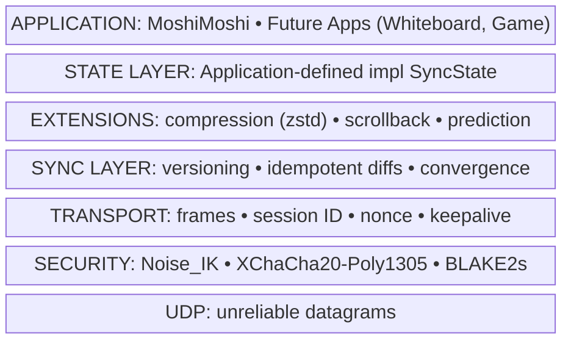
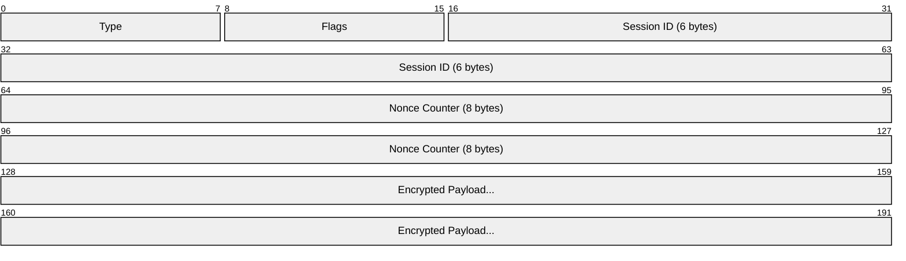

# NOMAD Protocol Specs

> **NOMAD** - **N**etwork-**O**ptimized **M**obile **A**pplication **D**atagram

## Overview

This repository contains **specifications only** for the NOMAD Protocol, a secure UDP-based state synchronization protocol inspired by Mosh. No actual implementations live here.

**This repo contains:**
- Formal protocol specifications (refined from brainstorm/)
- E2E conformance test suite (Python)
- Test vectors (JSON)
- Docker infrastructure for testing implementations

**This repo does NOT contain:**
- Rust/Go/etc implementations (separate repos)
- MoshiMoshi app (separate repo)
- Terminal state type implementation

## Architecture Layers



## Directory Structure

```
nomad-specs/
├── specs/                    # Formal specifications
│   ├── PROTOCOL.md           # Core protocol spec
│   ├── SECURITY.md           # Security layer spec
│   ├── TRANSPORT.md          # Transport layer spec
│   ├── SYNC.md               # Sync layer spec
│   └── EXTENSIONS.md         # Extension mechanism
│
├── tests/                    # E2E conformance suite (Python)
│   ├── pyproject.toml
│   ├── conftest.py           # pytest fixtures
│   │
│   ├── vectors/              # Static test vectors (JSON5)
│   │   ├── handshake_vectors.json5
│   │   ├── frame_vectors.json5
│   │   └── sync_vectors.json5
│   │
│   ├── unit/                 # Pure logic tests (all implementations)
│   ├── protocol/             # Protocol behavior tests (all implementations)
│   ├── wire/                 # Byte-level validation (all implementations)
│   ├── interop/              # Cross-implementation tests
│   ├── adversarial/          # Security tests (all implementations)
│   ├── terminal/             # Terminal-specific tests (terminal impls only)
│   │
│   └── lib/                  # Test utilities
│       ├── containers.py     # Docker management
│       ├── network.py        # scapy helpers
│       ├── generators.py     # hypothesis strategies
│       └── reference.py      # Python reference encoder/decoder
│
├── docker/                   # Docker infrastructure
│   ├── docker-compose.yml
│   └── Dockerfile.stub       # Minimal stub for spec testing
│
├── brainstorm/               # Original brainstorm docs (reference)
│
└── .octopus/                 # Parallel dev coordination
```

## Tech Stack

- **Specs**: Markdown with Mermaid diagrams (renders on GitHub)
- **Test Suite**: Python 3.11+
  - pytest (test runner)
  - hypothesis (property-based testing)
  - scapy (packet inspection)
  - docker (container orchestration)
- **Dependency Management**: uv
- **Containers**: Docker Compose

## Diagram Conventions

Use **Mermaid** for all diagrams (renders natively on GitHub):

- **Architecture/Flow**: `block-beta` or `flowchart`
- **Packet formats**: `packet` diagram (v11.0.0+)
- **State machines**: `stateDiagram-v2`
- **Sequences**: `sequenceDiagram`

### Packet Diagram Example

For protocol packet formats in specs, use Mermaid `packet` diagrams with `+<count>` syntax:



The `+<count>` specifies bits per field. This renders cleanly on GitHub.

## Test Categories

Tests are organized so implementations can validate core protocol vs state-specific behavior:

| Category | Path | Required For | Description |
|----------|------|--------------|-------------|
| Unit | `tests/unit/` | All | Pure logic tests (encoding, crypto) |
| Protocol | `tests/protocol/` | All | Protocol behavior (handshake, sync, rekey) |
| Wire | `tests/wire/` | All | Byte-level format compliance |
| Adversarial | `tests/adversarial/` | All | Security tests (replay, malformed) |
| Terminal | `tests/terminal/` | Terminal only | Scrollback, prediction, terminal state |
| Interop | `tests/interop/` | Optional | Cross-implementation testing |

**Run core tests:** `just test-core` (excludes terminal/)
**Run all tests:** `just test` (includes terminal/)

## Octopus Tentacle Breakdown

| ID | Scope | Description |
|----|-------|-------------|
| t1-security | specs/SECURITY.md, tests/unit/test_crypto*, tests/protocol/test_handshake* | Security layer spec + tests |
| t2-transport | specs/TRANSPORT.md, tests/unit/test_frame*, tests/wire/* | Transport layer spec + tests |
| t3-sync | specs/SYNC.md, tests/protocol/test_sync*, tests/unit/test_diff* | Sync layer spec + tests |
| t4-extensions | specs/EXTENSIONS.md, tests/protocol/test_extension* | Extension mechanism spec + tests |
| t5-docker | docker/*, tests/lib/containers.py, tests/conftest.py | Docker orchestration, plug & play infrastructure |
| t6-vectors | tests/vectors/*, tests/lib/reference.py | Test vectors generation, Python reference codec |

## Conventions

- Specs must be **isomorphic to tests**: each spec section maps to test cases
- Test vectors are the **single source of truth** for byte formats
- All packet formats use **little-endian** unless specified
- Use **hypothesis** for property-based tests (edge cases)
- Docker containers must implement a standard interface (see CONFORMANCE.md)
- brainstorm/ is kept as historical reference; specs/ is canonical

## Test Vector Strategy

Vectors are **generated using reference libraries**, stored as **JSON5** (supports comments):

```
specs/
├── PROTOCOL.md              # Human-readable spec
└── generate_vectors.py      # Executable spec (idempotent)

tests/vectors/
├── handshake_vectors.json5  # Generated from snow + test keypairs
├── frame_vectors.json5      # Generated from cryptography lib
└── README.md                # Documents derivation of each vector
```

- **JSON5 format**: Allows inline comments explaining each field
- **Idempotent generation**: Running twice produces identical output (reproducibility)
- Use `snow` (Noise protocol) and `cryptography` (XChaCha20-Poly1305) as reference
- Each vector includes metadata explaining its derivation
- No magic numbers: every value traceable to spec + reference lib

## Commands

```bash
# Run tests (once tests/ is set up)
just test

# Run specific test category
just test-unit
just test-protocol
just test-wire

# Start docker containers
just docker-up

# Generate test vectors from specs
just gen-vectors
```

## Plug & Play Architecture

Implementations are tested by:
1. Building their server/client as Docker images
2. Pointing docker-compose to those images
3. Running the conformance test suite

The test suite doesn't know or care what language the implementation uses.
