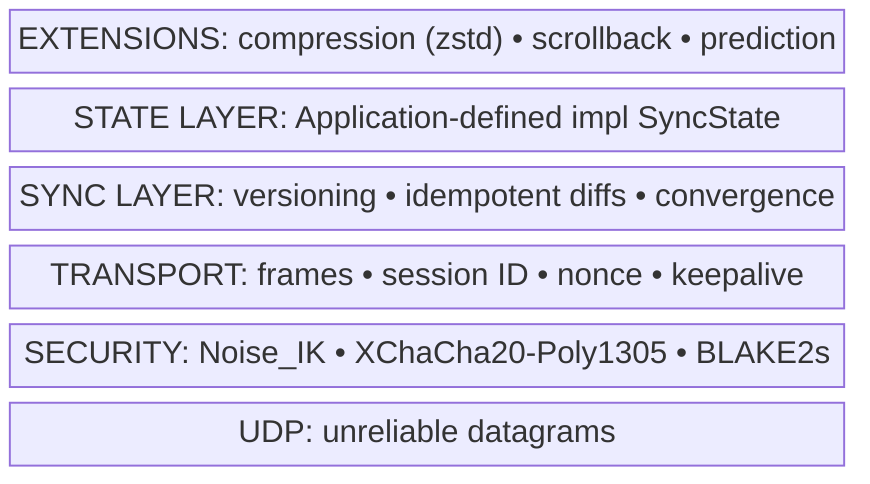
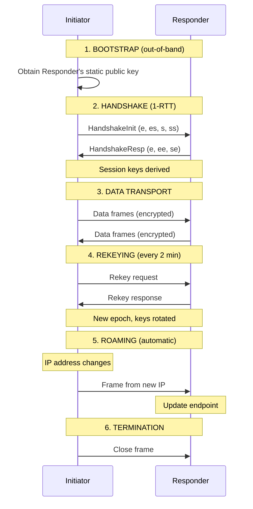

# NOMAD Protocol Specification v1.0

> **NOMAD** - **N**etwork-**O**ptimized **M**obile **A**pplication **D**atagram

**Version:** 1.0
**Status:** Draft
**Last Updated:** 2025-12-25

---

## Abstract

NOMAD is a secure, UDP-based state synchronization protocol designed for real-time applications over unreliable networks. It provides authenticated encryption, seamless connection migration across IP address changes, and a generic state synchronization framework with optional client-side prediction.

NOMAD is inspired by [Mosh](https://mosh.org/) (Mobile Shell) and its State Synchronization Protocol, but is a new protocol with different design choices. **NOMAD is not compatible with Mosh.**

---

## Design Goals

1. **Security**: End-to-end authenticated encryption with forward secrecy
2. **Mobility**: Seamless operation across IP address changes (roaming)
3. **Latency**: Sub-100ms reconnection, optional client-side prediction
4. **Simplicity**: Fixed cryptographic suite, no negotiation
5. **Generality**: State-agnostic synchronization framework

## Non-Goals

- Backward compatibility with Mosh/SSP
- Cipher suite negotiation
- Reliable ordered delivery (applications handle this via state sync)
- Multiplexing multiple state types in one session

---

## Protocol Layers



| Layer | Specification | Responsibility |
|-------|---------------|----------------|
| Security | [1-SECURITY.md](1-SECURITY.md) | Handshake, encryption, rekeying |
| Transport | [2-TRANSPORT.md](2-TRANSPORT.md) | Framing, session management, roaming |
| Sync | [3-SYNC.md](3-SYNC.md) | State versioning, diffs, convergence |
| Extensions | [4-EXTENSIONS.md](4-EXTENSIONS.md) | Compression, scrollback, prediction |

---

## Terminology

| Term | Definition |
|------|------------|
| **Initiator** | The party that starts the connection (typically the client) |
| **Responder** | The party that accepts connections (typically the server) |
| **Session** | A cryptographic context between two parties, survives IP changes |
| **Epoch** | A period using a single set of session keys (until rekey) |
| **State** | Application-specific data being synchronized |
| **Diff** | A delta representing changes between two state versions (must be idempotent) |
| **Frame** | A single encrypted UDP datagram |
| **Handshake** | The Noise_IK key exchange establishing a session |

### Notation

```
||        Concatenation
len(x)    Length of x in bytes
LE16      16-bit little-endian unsigned integer
LE32      32-bit little-endian unsigned integer
LE64      64-bit little-endian unsigned integer
[n]       Array of n bytes
```

---

## Connection Lifecycle



---

## Cryptographic Suite

NOMAD uses a **fixed** cryptographic suite with **no negotiation**. If vulnerabilities are discovered, a new protocol version is released.

| Purpose | Algorithm | Reference |
|---------|-----------|-----------|
| Key Exchange | X25519 | RFC 7748 |
| AEAD Cipher | XChaCha20-Poly1305 | draft-irtf-cfrg-xchacha |
| Hash Function | BLAKE2s-256 | RFC 7693 |
| Key Derivation | HKDF-BLAKE2s | Noise specification |

### Constants

| Constant | Value | Notes |
|----------|-------|-------|
| `AEAD_TAG_SIZE` | 16 bytes | Poly1305 tag |
| `AEAD_NONCE_SIZE` | 24 bytes | XChaCha20 |
| `PUBLIC_KEY_SIZE` | 32 bytes | X25519 |
| `PRIVATE_KEY_SIZE` | 32 bytes | X25519 |
| `HASH_SIZE` | 32 bytes | BLAKE2s |
| `SESSION_ID_SIZE` | 6 bytes | 48-bit |

### Timing Constants Summary

All timing constants in one place (details in respective specs):

| Constant | Value | Spec | Description |
|----------|-------|------|-------------|
| `INITIAL_RTO` | 1000 ms | TRANSPORT | Initial retransmission timeout |
| `MIN_RTO` | 100 ms | TRANSPORT | Minimum RTO |
| `MAX_RTO` | 60000 ms | TRANSPORT | Maximum RTO |
| `MIN_FRAME_INTERVAL` | SRTT/2 or 20ms | TRANSPORT | Minimum time between frames |
| `COLLECTION_INTERVAL` | 8 ms | TRANSPORT | Batch rapid state changes |
| `DELAYED_ACK_TIMEOUT` | 100 ms | TRANSPORT | Max delay for ack-only |
| `MAX_FRAME_RATE` | 50 Hz | TRANSPORT | Hard cap on frame rate |
| `KEEPALIVE_INTERVAL` | 25 s | TRANSPORT | Send keepalive if idle |
| `DEAD_INTERVAL` | 60 s | TRANSPORT | Connection timeout |
| `REKEY_AFTER_TIME` | 120 s | SECURITY | Initiate rekey |
| `REJECT_AFTER_TIME` | 180 s | SECURITY | Reject old keys |
| `REKEY_AFTER_MESSAGES` | 2^60 | SECURITY | Soft message limit |
| `REJECT_AFTER_MESSAGES` | 2^64-1 | SECURITY | Hard message limit |
| `HANDSHAKE_TIMEOUT` | 1000 ms | SECURITY | Initial handshake timeout |
| `HANDSHAKE_MAX_RETRIES` | 5 | SECURITY | Handshake retry limit |

---

## Frame Types

| Type | Value | Description | Spec |
|------|-------|-------------|------|
| HandshakeInit | `0x01` | Initiate handshake | [1-SECURITY.md](1-SECURITY.md) |
| HandshakeResp | `0x02` | Handshake response | [1-SECURITY.md](1-SECURITY.md) |
| Data | `0x03` | Encrypted data frame | [2-TRANSPORT.md](2-TRANSPORT.md) |
| Rekey | `0x04` | Initiate rekeying | [1-SECURITY.md](1-SECURITY.md) |
| Close | `0x05` | Graceful termination | [2-TRANSPORT.md](2-TRANSPORT.md) |

---

## State Type Registry

State types are identified by reverse-domain notation:

```
<domain>.<type>.<version>

Examples:
  nomad.echo.v1       # Simple echo (for testing)
  nomad.terminal.v1   # Terminal emulator state
  com.example.game.v1 # Custom game state
```

### Standard State Types

| ID | Description | Specification |
|----|-------------|---------------|
| `nomad.echo.v1` | Simple echo for testing | Payload is UTF-8 text |
| `nomad.terminal.v1` | Terminal emulator state | See TERMINAL.md |

---

## Test Categories

Tests are organized to allow implementations to validate core protocol vs state-specific behavior:

| Category | Path | Required For |
|----------|------|--------------|
| Core Protocol | `tests/protocol/` | All implementations |
| Wire Format | `tests/wire/` | All implementations |
| Security | `tests/adversarial/` | All implementations |
| Terminal State | `tests/terminal/` | Terminal implementations only |

---

## References

1. Winstein, K., & Balakrishnan, H. (2012). Mosh: An Interactive Remote Shell for Mobile Clients. USENIX ATC.
2. Perrin, T. (2018). The Noise Protocol Framework. noiseprotocol.org
3. Donenfeld, J. A. (2017). WireGuard: Next Generation Kernel Network Tunnel. NDSS.
4. Nir, Y., & Langley, A. (2018). ChaCha20 and Poly1305 for IETF Protocols. RFC 8439.
5. Bernstein, D. J. (2006). Curve25519: New Diffie-Hellman Speed Records. PKC.

---

_This specification is released under CC BY 4.0._
