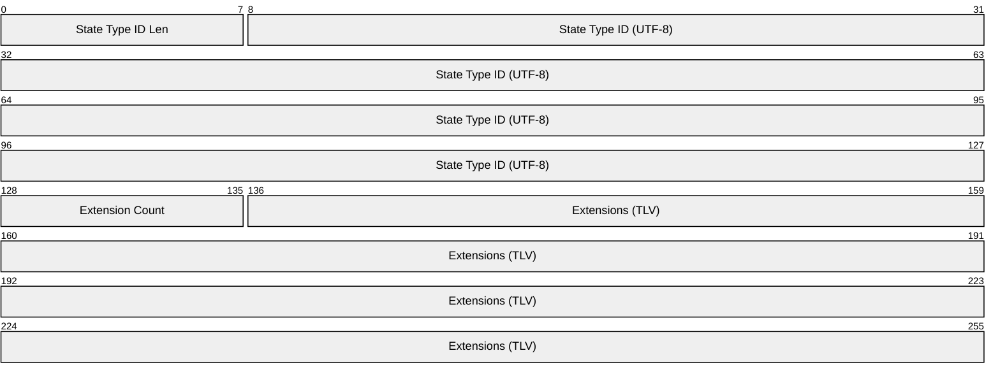
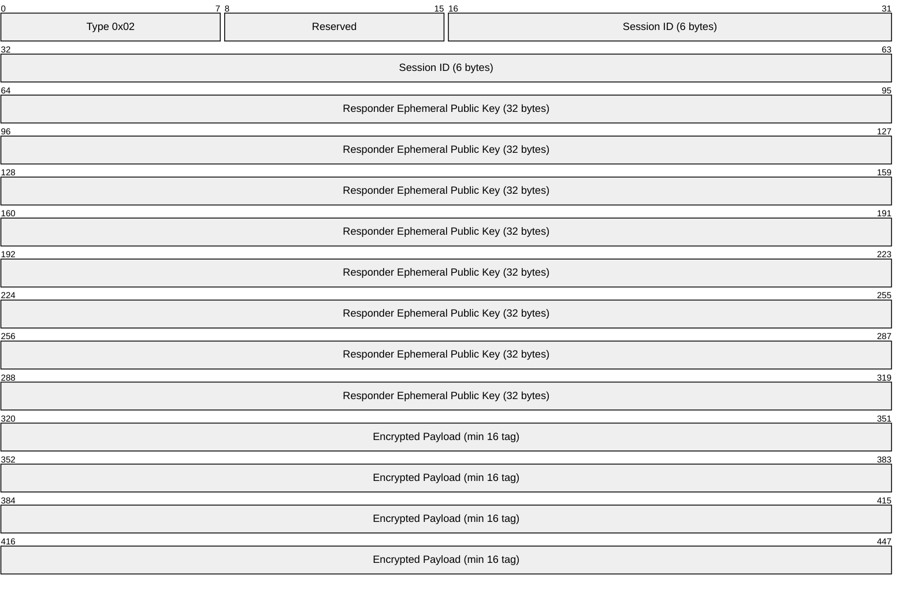
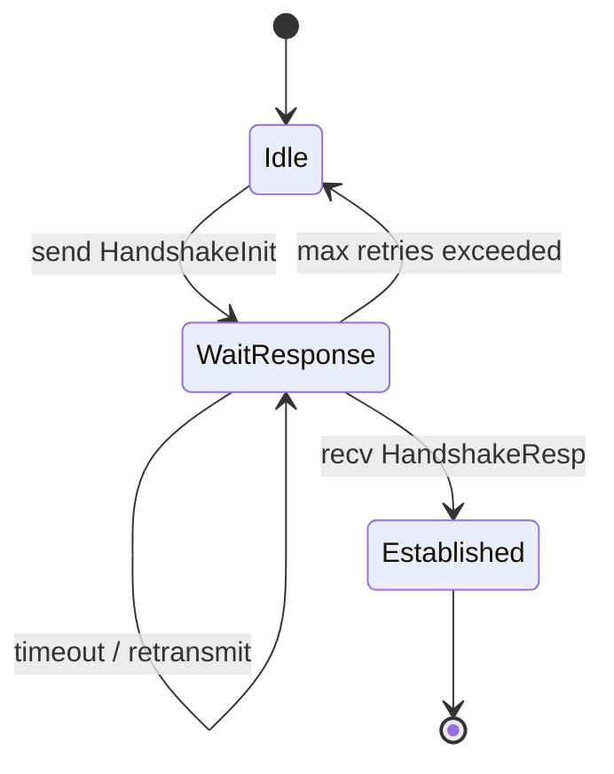
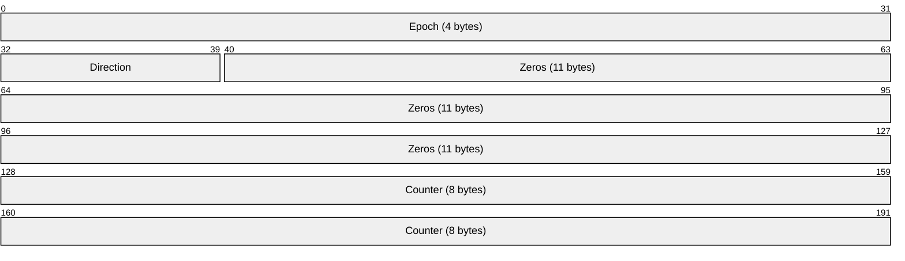
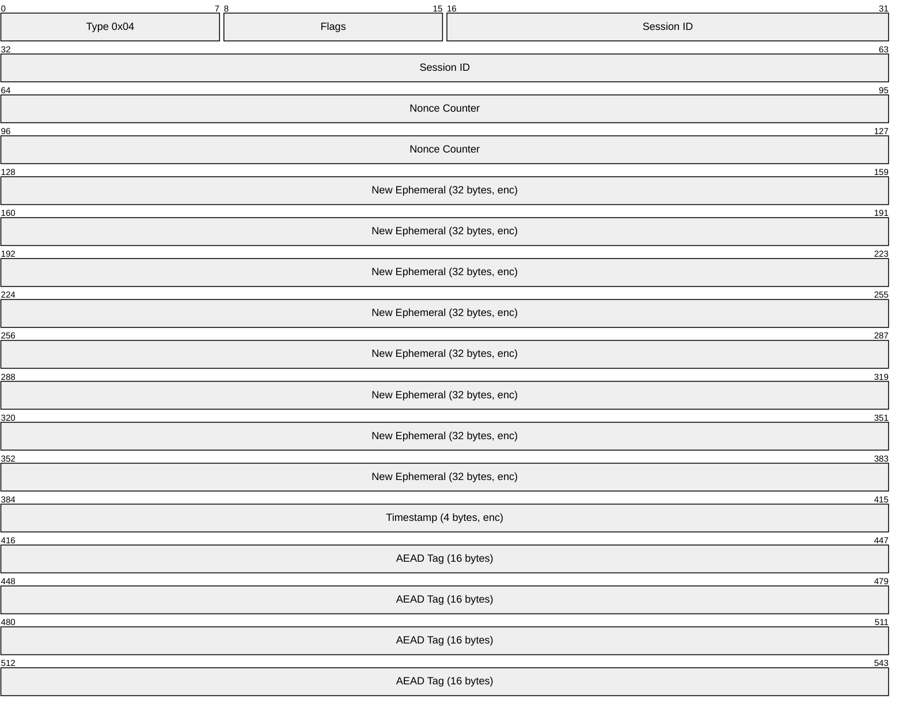
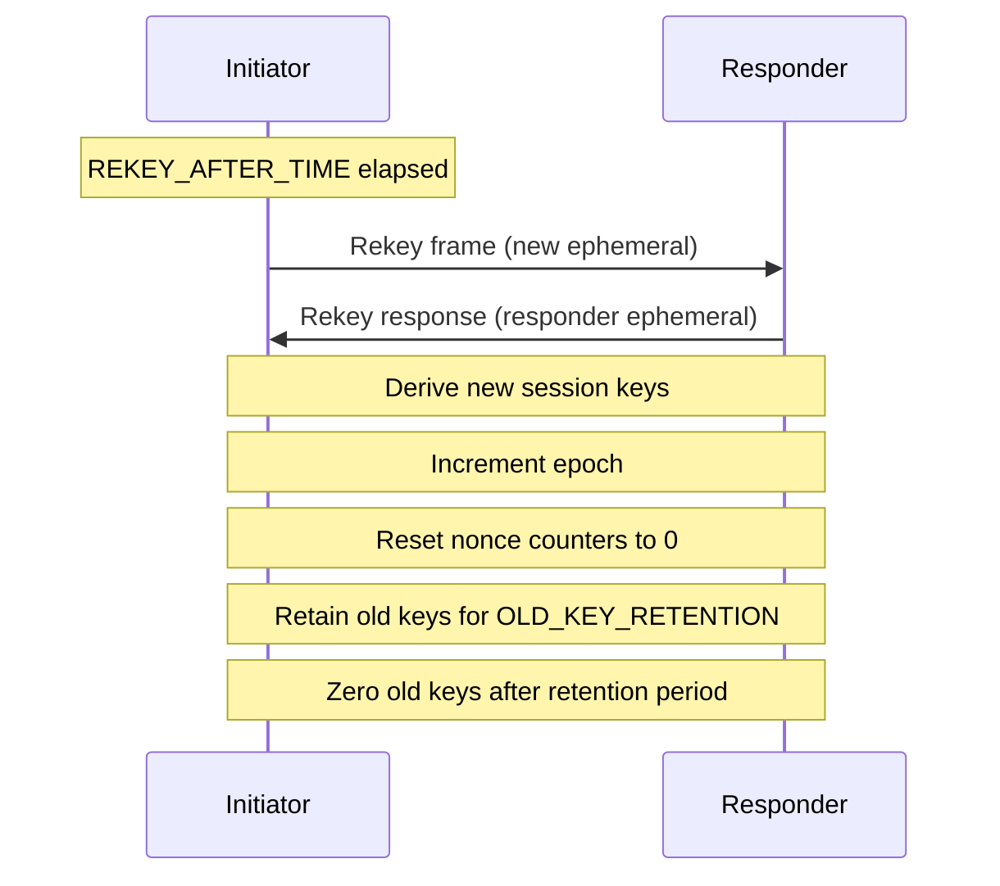

# NOMAD Security Layer Specification

**Parent:** [0-PROTOCOL.md](0-PROTOCOL.md)

---

## Overview

The security layer provides:
- Mutual authentication via Noise_IK handshake
- Authenticated encryption via XChaCha20-Poly1305
- Forward secrecy via periodic rekeying
- Identity hiding for initiator

---

## Handshake Protocol

NOMAD uses the **Noise_IK** pattern for 1-RTT mutual authentication.

### Prerequisites

- Initiator MUST know Responder's static public key beforehand (via SSH, QR code, etc.)
- Both parties MUST have static X25519 keypairs

### Noise_IK Pattern

```
Noise_IK(s, rs):
  <- s                    # Responder's static key known to Initiator
  ...
  -> e, es, s, ss         # Initiator sends ephemeral + encrypted static
  <- e, ee, se            # Responder sends ephemeral, completes DH
```

Where:
- `e` = ephemeral public key (32 bytes)
- `s` = static public key (encrypted after first DH)
- `es`, `ss`, `ee`, `se` = Diffie-Hellman operations mixed into symmetric state

---

## Handshake Initiation (Type 0x01)

Initiator → Responder


| Field | Offset | Size | Description |
|-------|--------|------|-------------|
| Type | 0 | 1 byte | `0x01` (HandshakeInit) |
| Reserved | 1 | 1 byte | `0x00` |
| Protocol Version | 2 | 2 bytes | `0x0001` for v1.0 (LE16) |
| Initiator Ephemeral | 4 | 32 bytes | Unencrypted X25519 public key |
| Encrypted Static | 36 | 48 bytes | Initiator's static key + AEAD tag |
| Encrypted Payload | 84 | variable | State type ID + extensions + AEAD tag |

**Minimum size:** 100 bytes (4 + 32 + 48 + 16)

### Encrypted Payload Contents



---

## Handshake Response (Type 0x02)

Responder → Initiator



| Field | Offset | Size | Description |
|-------|--------|------|-------------|
| Type | 0 | 1 byte | `0x02` (HandshakeResp) |
| Reserved | 1 | 1 byte | `0x00` |
| Session ID | 2 | 6 bytes | Random identifier for this session (see §Session ID) |
| Responder Ephemeral | 8 | 32 bytes | Unencrypted X25519 public key |
| Encrypted Payload | 40 | variable | Ack + negotiated extensions + AEAD tag |

**Minimum size:** 56 bytes (8 + 32 + 16)

---

## Session Key Derivation

After successful handshake, both parties derive session keys using HKDF with BLAKE2s.

### HKDF Construction

NOMAD uses HKDF (RFC 5869) instantiated with BLAKE2s as the hash function:
- **HKDF-Extract**: `PRK = HMAC-BLAKE2s(salt, IKM)`
- **HKDF-Expand**: `OKM = HMAC-BLAKE2s(PRK, info || 0x01) || ...`

For Noise protocol integration, the salt is empty (zero-length) and the IKM
is the Noise handshake hash.

### Session Keys (Epoch 0)

The `handshake_hash` is the final 32-byte symmetric state after all Noise_IK
messages have been processed. Both parties compute identical values.

```python
# Extract (salt is empty per Noise specification)
PRK_session = HKDF-Extract(salt=b"", IKM=handshake_hash)

# Expand to 64 bytes
(initiator_key, responder_key) = HKDF-Expand(
    PRK_session,
    "nomad v1 session keys",
    64
)
```

| Party | Send Key | Receive Key |
|-------|----------|-------------|
| Initiator | `initiator_key` | `responder_key` |
| Responder | `responder_key` | `initiator_key` |

### Rekey Authentication Key

The `rekey_auth_key` is derived separately from the **static DH** to provide
post-compromise security (see §Post-Rekey Keys for threat model).

```python
# static_dh_secret = DH(initiator_static_private, responder_static_public)
PRK_rekey = HKDF-Extract(salt=b"", IKM=static_dh_secret)

rekey_auth_key = HKDF-Expand(
    PRK_rekey,
    "nomad v1 rekey auth",
    32
)
```

This key MUST be retained for the session lifetime (used in every rekey operation).

---

## Session ID

The 6-byte (48-bit) session ID is generated by the responder and used for frame demultiplexing.

### Generation

```python
def generate_session_id():
    return secure_random(6)  # 48 bits of randomness
```

### Collision Handling

With 48-bit session IDs, birthday paradox gives ~50% collision probability after 2^24 (~16 million) sessions.

Responders MUST:
1. Track active session IDs
2. Reject new sessions with colliding IDs
3. Generate new random ID on collision (retry up to 3 times)

```python
def create_session():
    for _ in range(3):
        session_id = generate_session_id()
        if session_id not in active_sessions:
            active_sessions.add(session_id)
            return session_id
    raise Error("session ID collision - too many active sessions")
```

### Session ID Scope

Session IDs are **per-responder**, not globally unique. Each responder (server)
maintains its own set of active session IDs independently.

**Rationale for 48-bit:** With 48 bits, collision probability reaches 50% after
2^24 (~16.7 million) concurrent sessions per responder. For typical servers
handling 1,000-10,000 concurrent sessions, this provides 1,600-16,000× safety margin.
The 6-byte size also aligns efficiently with the frame header structure.

A 64-bit session ID would add 2 bytes per frame with negligible practical benefit.

---

## Handshake State Machine

### Retransmission

Handshake packets may be lost. Implementations MUST handle retransmission:



### Timing Constants

| Constant | Value | Description |
|----------|-------|-------------|
| `HANDSHAKE_TIMEOUT` | 1000 ms | Initial retransmit timeout |
| `HANDSHAKE_MAX_RETRIES` | 5 | Maximum retransmission attempts |
| `HANDSHAKE_BACKOFF` | 2× | Exponential backoff multiplier |

### Initiator Retransmission

```python
def initiate_handshake():
    timeout = HANDSHAKE_TIMEOUT
    for attempt in range(HANDSHAKE_MAX_RETRIES):
        send(handshake_init)
        if wait_for_response(timeout):
            return success
        timeout = min(timeout * 2, 30000)  # Cap at 30s
    return failure
```

### Responder Behavior

Responders MUST be stateless until HandshakeInit is verified:
- Process duplicate HandshakeInit by regenerating HandshakeResp
- Do NOT allocate session state until crypto verification succeeds

---

## AEAD Encryption

All post-handshake frames use XChaCha20-Poly1305 AEAD.

### Nonce Construction (24 bytes)



| Field | Value |
|-------|-------|
| Epoch | Current epoch number, starts at 0 |
| Direction | `0x00` = Initiator→Responder, `0x01` = Responder→Initiator |
| Zeros | Padding |
| Counter | Per-direction frame counter, starts at 0 |

**Rationale for 11-byte zero field:**

The nonce structure totals 24 bytes (4+1+11+8) to match XChaCha20's nonce requirement.
The zero padding:
1. Ensures domain separation between epochs and directions
2. Provides room for future extensions without protocol changes
3. Maintains constant nonce size for implementation simplicity

The direction byte prevents counter collision between initiator and responder traffic
without requiring additional synchronization state.

### Additional Authenticated Data (AAD)

The frame header is authenticated but not encrypted. This prevents bit-flipping attacks on header fields.

**AAD structure (exactly 16 bytes):**

| Offset | Size | Field |
|--------|------|-------|
| 0 | 1 | Frame type |
| 1 | 1 | Flags |
| 2 | 6 | Session ID |
| 8 | 8 | Nonce counter (LE64) |

```
AAD = type || flags || session_id || nonce_counter
```

Implementations MUST verify the AAD matches the frame header exactly.

---

## Rekeying (Type 0x04)

Sessions MUST rekey periodically for forward secrecy.

### Timing Constants

| Constant | Value | Description |
|----------|-------|-------------|
| `REKEY_AFTER_TIME` | 120 seconds | Initiate rekey after this time |
| `REKEY_AFTER_MESSAGES` | 2^60 | Initiate rekey after this many frames |
| `REJECT_AFTER_TIME` | 180 seconds | Hard limit, reject old keys |
| `REJECT_AFTER_MESSAGES` | 2^64 - 1 | **HARD LIMIT** - MUST terminate session |
| `OLD_KEY_RETENTION` | 5 seconds | Keep old keys after rekey for late packets |

### Counter Exhaustion

> ⚠️ **CRITICAL**: Nonce reuse with the same key is **catastrophic** for AEAD security.

Implementations MUST enforce hard limits:

```python
def send_frame():
    if send_nonce >= REJECT_AFTER_MESSAGES:
        terminate_session("counter exhaustion")
        return

    # ... proceed with encryption
```

If counter reaches `2^64 - 1`, the session MUST be terminated immediately. Do NOT wrap the counter.

### Rekey Frame Format

Encrypted with current session keys:



### Rekey Procedure



### Key Transition

During rekey, briefly retain old keys to handle in-flight packets:

```python
def on_rekey_complete(new_keys):
    old_keys = current_keys
    current_keys = new_keys
    current_epoch += 1
    send_nonce = 0
    recv_nonce = 0

    # Retain old keys briefly for late packets
    schedule_zero(old_keys, delay=OLD_KEY_RETENTION)

def decrypt_frame(frame):
    # Try current epoch first
    if try_decrypt(frame, current_keys):
        return success

    # Fall back to old keys if within retention window
    if old_keys and within_retention_window():
        if try_decrypt(frame, old_keys):
            return success  # Late packet from old epoch

    return failure
```

### Post-Rekey Keys (Post-Compromise Security)

New session keys are derived from both the new ephemeral DH AND the `rekey_auth_key`:

```python
# New ephemeral DH between fresh ephemeral keys
ephemeral_dh = DH(initiator_ephemeral_new, responder_ephemeral_new)

# CRITICAL: Concatenation order is ephemeral THEN auth key
(new_initiator_key, new_responder_key) = HKDF-Expand(
    ephemeral_dh || rekey_auth_key,  # 64 bytes total
    "nomad v1 rekey" || LE32(epoch),
    64
)
```

### Threat Model

**Attack scenario:** An attacker who has compromised current session keys
(e.g., via memory dump) attempts to maintain access after rekey.

**Without PCS fix (vulnerable):**
1. Attacker has `current_session_keys` from epoch N
2. Attacker intercepts rekey, injects their own ephemeral
3. Both parties derive: `new_keys = KDF(attacker_ephemeral_dh)`
4. Attacker knows `attacker_ephemeral_dh`, computes valid new keys
5. **Attacker maintains access indefinitely**

**With PCS fix (secure):**
1. Attacker has `current_session_keys` from epoch N
2. Attacker intercepts rekey, injects their own ephemeral
3. Both parties derive: `new_keys = KDF(attacker_ephemeral_dh || rekey_auth_key)`
4. Attacker does NOT have `rekey_auth_key` (derived from static DH during handshake)
5. **Attacker cannot compute valid new keys**

The `rekey_auth_key` is derived from `DH(s_initiator, S_responder)` which the
attacker cannot reproduce without static private keys. Session key compromise
alone is insufficient.

> See `formal/proverif/nomad_rekey_fixed.pv` for formal verification of this property.

### Why Retain rekey_auth_key?

Unlike ephemeral session keys (which are zeroed after each epoch), `rekey_auth_key`
MUST be retained for the session lifetime because it is needed for every subsequent
rekey operation. It provides the "static anchor" that prevents active attackers
from taking over a session.

---

## Anti-Replay Protection

Implementations MUST maintain a sliding window of received nonces.

| Parameter | Value |
|-----------|-------|
| Window size | 2048 bits minimum |
| Below window | MUST reject |
| Seen nonce | MUST reject |
| Above highest | Update window |

### Replay Check Ordering

> **CRITICAL**: The replay window MUST NOT advance until AFTER AEAD verification succeeds.

The check has two phases:
1. **Check** if nonce is a replay (cheap, read-only)
2. **Update** window with authenticated nonce (only after AEAD passes)

```python
def receive_frame(frame):
    nonce = parse_nonce(frame)

    # 1. Check if definitely a replay (read-only, does NOT advance window)
    #    This is safe because it only rejects; never modifies state
    if is_definite_replay(nonce):
        drop_silently()
        return

    # 2. AEAD verification (expensive, but required before trusting nonce)
    if not verify_aead(frame):
        drop_silently()
        return

    # 3. NOW safe to update window (nonce is authenticated)
    mark_seen(nonce)
    process_frame(frame)
```

> **Why this ordering matters**: If the window advanced before AEAD verification, an attacker could send forged packets with high nonces to advance the window, causing legitimate packets to be rejected as "replays". This would be a trivial DoS attack.

The `is_definite_replay()` check MUST be read-only:
- Nonce below window floor → reject (definite replay)
- Nonce in window bitmap → reject (already seen)
- Nonce above window → **pass through** (might be valid, verify first)

Only `mark_seen()` advances the window, and only for authenticated packets.

### Epoch Protection

Epoch numbers MUST NOT wrap:

```python
MAX_EPOCH = 2^32 - 1

def initiate_rekey():
    if current_epoch >= MAX_EPOCH:
        terminate_session("epoch exhaustion")
        return
    # ... proceed with rekey
```

If epoch reaches `2^32 - 1`, terminate the session and establish a new one via fresh handshake.

---

## Security Properties

| Property | Provided | Mechanism |
|----------|----------|-----------|
| Confidentiality | ✅ | XChaCha20-Poly1305 AEAD |
| Integrity | ✅ | Poly1305 authentication tag |
| Authenticity | ✅ | Noise_IK mutual authentication |
| Forward secrecy | ✅ | Ephemeral keys + 2-minute rekeying |
| Post-compromise security | ✅ | `rekey_auth_key` mixed into rekey KDF |
| Replay protection | ✅ | Nonce counter + sliding window |
| Identity hiding (initiator) | ✅ | Static key encrypted under responder's key |
| Identity hiding (responder) | ❌ | Responder's public key must be known |

---

## Implementation Requirements

Implementations MUST:

1. Use constant-time comparison for all secret-dependent operations
2. Zero memory containing keys when no longer needed
3. Use cryptographically secure RNG for all random values
4. Validate all input lengths before processing
5. Reject frames with invalid AEAD tags without timing differences

Implementations SHOULD:

1. Add random delays (0-50ms) to keystroke-like input to resist timing analysis
2. Pad frames to fixed sizes when traffic analysis is a concern
3. Implement rate limiting on handshake attempts
4. Log security-relevant events

---

## Test Vectors

See `tests/vectors/handshake_vectors.json5` for:
- Valid handshake initiation messages
- Valid handshake response messages
- Session key derivation test cases
- AEAD encryption test cases
- Rekey test cases

---

## Formal Verification

The security layer has been formally verified using ProVerif and TLA+.

### ProVerif Models

| Model | Properties Verified |
|-------|---------------------|
| `formal/proverif/nomad_handshake.pv` | Noise_IK authentication, key secrecy, identity hiding |
| `formal/proverif/nomad_rekey.pv` | Forward secrecy, post-compromise security |
| `formal/proverif/nomad_replay.pv` | Replay protection, nonce uniqueness |

### TLA+ Specifications

| Spec | Properties Verified |
|------|---------------------|
| `formal/tlaplus/RekeyStateMachine.tla` | Key rotation correctness, epoch management, counter limits |

### Verified Security Properties

All security properties listed in §Security Properties have been formally verified:

| Property | Verification Tool | Result |
|----------|-------------------|--------|
| Confidentiality | ProVerif | ✅ Proven |
| Authenticity | ProVerif | ✅ Proven |
| Forward secrecy | ProVerif + TLA+ | ✅ Proven |
| Post-compromise security | ProVerif | ✅ Proven (`nomad_rekey_fixed.pv`) |
| Replay protection | ProVerif | ✅ Proven |
| Identity hiding (initiator) | ProVerif | ✅ Proven |

See `formal/README.md` for instructions on running the verification tools.

---

## Test Mapping

| Spec Section | Test File |
|--------------|-----------|
| Handshake | `tests/protocol/test_handshake.py` |
| Handshake retransmission | `tests/protocol/test_handshake_retransmit.py` |
| Session ID collision | `tests/protocol/test_session_id.py` |
| AEAD | `tests/unit/test_crypto.py` |
| Nonce construction | `tests/unit/test_nonce.py` |
| Counter exhaustion | `tests/unit/test_counter_limits.py` |
| Rekeying | `tests/protocol/test_rekeying.py` |
| Key transition | `tests/protocol/test_key_transition.py` |
| Anti-replay | `tests/protocol/test_replay_rejection.py` |
| Epoch exhaustion | `tests/protocol/test_epoch_limits.py` |
| Invalid auth | `tests/adversarial/test_invalid_auth.py` |
