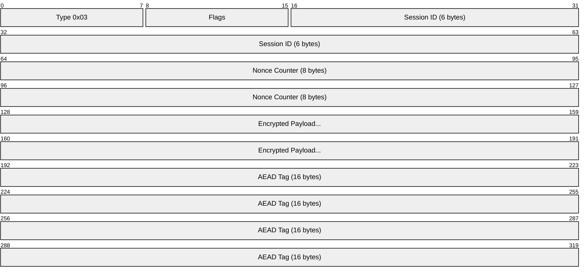
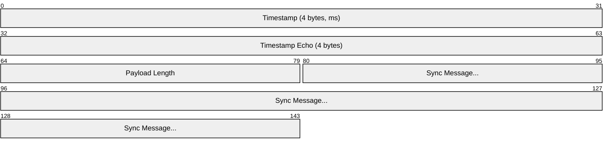
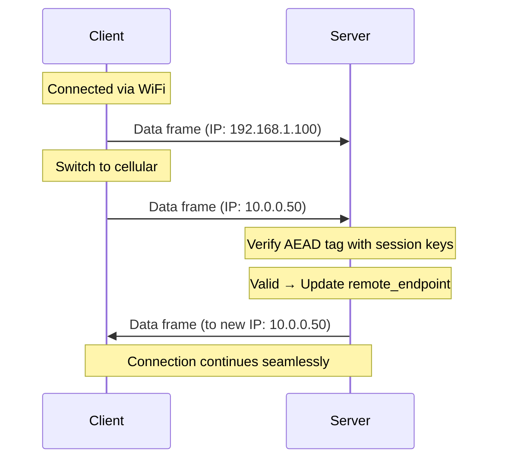

# NOMAD Transport Layer Specification

**Parent:** [0-PROTOCOL.md](0-PROTOCOL.md)

---

## Overview

The transport layer provides:
- Frame construction and parsing
- Session identification
- Connection migration (roaming)
- RTT estimation and adaptive timing
- Keepalive and timeout management
- Graceful termination

---

## Connection State

Each endpoint maintains:

```python
class ConnectionState:
    session_id: bytes[6]         # From handshake
    send_key: bytes[32]          # Current sending key
    recv_key: bytes[32]          # Current receiving key
    send_nonce: uint64           # Monotonically increasing
    recv_nonce_window: BitField  # Anti-replay window (2048+ bits)
    remote_endpoint: SocketAddr  # Last known peer address
    last_received: Timestamp     # For timeout detection
    epoch: uint32                # Increments on rekey

    # RTT estimation (see §RTT Estimation)
    srtt: float                  # Smoothed RTT in milliseconds
    rttvar: float                # RTT variance
    last_send_time: Timestamp    # When we last sent a frame
    pending_timestamp: uint32    # Timestamp awaiting echo

    # Frame pacing (see §Frame Pacing)
    last_frame_sent: Timestamp   # For rate limiting
    pending_state_change: bool   # State changed, awaiting collection interval
```

---

## Data Frame Format (Type 0x03)



| Field | Size | Description |
|-------|------|-------------|
| Type | 1 byte | `0x03` (Data) |
| Flags | 1 byte | See flags table below |
| Session ID | 6 bytes | Session identifier from handshake |
| Nonce Counter | 8 bytes | LE64, per-direction counter |
| Encrypted Payload | variable | Payload header + sync message |
| AEAD Tag | 16 bytes | Poly1305 authentication tag |

**Header size:** 16 bytes (unencrypted, used as AAD)
**Minimum frame size:** 32 bytes (header + empty payload + tag)

### Flags Byte

| Bit | Name | Description |
|-----|------|-------------|
| 0 | ACK_ONLY | Frame contains only acknowledgment, no state diff |
| 1 | HAS_EXTENSION | Extension data follows payload |
| 2-7 | Reserved | Must be 0 |

---

## Encrypted Payload Structure

After decryption:



| Field | Size | Description |
|-------|------|-------------|
| Timestamp | 4 bytes | Sender's current time in ms since session start (LE32) |
| Timestamp Echo | 4 bytes | Most recent timestamp received from peer (LE32), or 0 |
| Payload Length | 2 bytes | Length of sync message (LE16) |
| Sync Message | variable | See [3-SYNC.md](3-SYNC.md) |

The timestamp fields enable RTT estimation (see §RTT Estimation).

---

## Close Frame Format (Type 0x05)

For graceful termination:


| Field | Size | Description |
|-------|------|-------------|
| Type | 1 byte | `0x05` (Close) |
| Flags | 1 byte | `0x00` |
| Session ID | 6 bytes | Session identifier |
| Nonce Counter | 8 bytes | LE64 |
| Final Ack | 8 bytes | Highest state version acked (encrypted) |
| AEAD Tag | 16 bytes | Authentication tag |

---

## Connection Migration (Roaming)

NOMAD supports seamless IP address changes (WiFi ↔ cellular).

### Migration Procedure



### Migration Rules

1. When authenticated frame arrives from different source address:
   - Verify AEAD tag with current session keys
   - If valid: update `remote_endpoint` to new address
   - If invalid: silently drop (prevents spoofing)
2. Immediately send subsequent frames to new address
3. No handshake required
4. Works for both initiator and responder

### Anti-Amplification

To prevent DDoS amplification attacks via address spoofing:

1. **Unvalidated address limit**: Before receiving an authenticated frame from a new address, endpoint MUST NOT send more than **3× the bytes received** from that address.
2. **Validation**: An address is considered "validated" after receiving any frame with valid AEAD tag from it.
3. **Rate limiting**: Implementations SHOULD rate-limit migrations to at most one per second from different /24 (IPv4) or /48 (IPv6) subnets.

```python
def on_migration(frame, new_addr):
    if not is_validated(new_addr):
        bytes_sent_to[new_addr] += len(response)
        if bytes_sent_to[new_addr] > 3 * bytes_recv_from[new_addr]:
            return  # Amplification limit reached

    if verify_aead(frame):
        mark_validated(new_addr)
        remote_endpoint = new_addr
```

---

## Keepalive

### Timing Constants

| Constant | Value | Description |
|----------|-------|-------------|
| `KEEPALIVE_INTERVAL` | 25 seconds | Send keepalive if no data sent |
| `DEAD_INTERVAL` | 60 seconds | Consider connection dead if no frames received |

### Keepalive Frame

A keepalive is a Data frame (0x03) with:
- Flags: `ACK_ONLY` (0x01)
- Payload: Zero-length sync message (just the ack)

---

## RTT Estimation

Accurate RTT measurement is **critical** for performance. Without it, retransmission timing and frame pacing cannot adapt to network conditions.

### Timestamp Protocol

Every frame carries:
- **Timestamp**: Sender's local time (ms since session start)
- **Timestamp Echo**: Most recent timestamp received from peer

When a frame is received with a timestamp echo:
```python
def on_timestamp_echo(echo_ts, recv_time):
    if echo_ts == pending_timestamp:
        rtt_sample = recv_time - last_send_time
        update_rtt(rtt_sample)
        pending_timestamp = 0
```

### RTT Calculation (RFC 6298)

```python
# Initial values (before first measurement)
SRTT = 0
RTTVAR = 0
RTO = 1000  # 1 second initial timeout

def update_rtt(sample):
    if SRTT == 0:
        # First measurement
        SRTT = sample
        RTTVAR = sample / 2
    else:
        # Subsequent measurements
        RTTVAR = 0.75 * RTTVAR + 0.25 * abs(SRTT - sample)
        SRTT = 0.875 * SRTT + 0.125 * sample

    RTO = SRTT + max(100, 4 * RTTVAR)  # Minimum 100ms granularity
    RTO = min(RTO, MAX_RTO)            # Cap at MAX_RTO
```

### RTT Constants

| Constant | Value | Description |
|----------|-------|-------------|
| `INITIAL_RTO` | 1000 ms | Before first RTT sample |
| `MIN_RTO` | 100 ms | Minimum retransmission timeout |
| `MAX_RTO` | 60000 ms | Maximum retransmission timeout |

---

## Frame Pacing

To prevent buffer bloat and network congestion, implementations MUST pace frame transmission.

### Timing Constants

| Constant | Value | Description |
|----------|-------|-------------|
| `MIN_FRAME_INTERVAL` | `max(SRTT/2, 20ms)` | Minimum time between frames |
| `COLLECTION_INTERVAL` | 8 ms | Wait after state change before sending |
| `DELAYED_ACK_TIMEOUT` | 100 ms | Max time to delay ack-only frame |
| `MAX_FRAME_RATE` | 50 Hz | Hard cap on frame rate |

### Frame Pacing Algorithm

```python
def maybe_send_frame():
    now = current_time()

    # Respect minimum frame interval
    min_interval = max(SRTT / 2, 20)  # ms
    if now - last_frame_sent < min_interval:
        schedule_send(last_frame_sent + min_interval)
        return

    # Collection interval: batch rapid state changes
    if pending_state_change:
        if now - state_change_time < COLLECTION_INTERVAL:
            schedule_send(state_change_time + COLLECTION_INTERVAL)
            return

    # Delayed ACK: wait to piggyback on data
    if ack_pending and not data_pending:
        if now - ack_pending_since < DELAYED_ACK_TIMEOUT:
            schedule_send(ack_pending_since + DELAYED_ACK_TIMEOUT)
            return

    send_frame()
    last_frame_sent = now
```

### Rationale

- **SRTT/2 interval**: Ensures roughly one frame in flight at a time, preventing queue buildup
- **Collection interval**: Batches rapid state changes (e.g., fast typing) into single frames
- **Delayed ACK**: 99.9% of acks piggyback on data frames (Mosh measurement)
- **50 Hz cap**: Human perception threshold; faster updates waste bandwidth

---

## Retransmission

### Adaptive Retransmission

Unlike the fixed 250ms interval, retransmission MUST be adaptive:

```python
def should_retransmit():
    if last_acked < current_state_num:
        if time_since_last_send > RTO:
            return True
    return False

def on_retransmit_timeout():
    RTO = min(RTO * 2, MAX_RTO)  # Exponential backoff
    retransmit_count += 1
```

### Retransmission Constants

| Constant | Value | Description |
|----------|-------|-------------|
| `MAX_RETRANSMITS` | 10 | Give up after this many retransmits |
| `RETRANSMIT_BACKOFF` | 2× | Exponential backoff multiplier |

---

## Timeout and Termination

### Graceful Close

1. Send Close frame with final ack
2. Zero all key material
3. Close socket
4. No response expected (best-effort)

### Timeout

1. If no authenticated frame received for `DEAD_INTERVAL`:
   - Consider session dead
   - Zero all key material
2. May attempt reconnection with new handshake

---

## Error Handling

| Error | Response | Rationale |
|-------|----------|-----------|
| Invalid AEAD tag | Silently drop | Prevent oracle attacks |
| Unknown session ID | Silently drop | Prevent session enumeration |
| Nonce replay | Silently drop | Prevent replay attacks |
| Frame too small | Silently drop | Prevent parsing exploits |
| Nonce below window | Silently drop | Old/replayed frame |

**Silent drops** prevent confirmation of session existence to attackers.

---

## MTU Considerations

| Network | Typical MTU | Recommended Max Payload |
|---------|-------------|-------------------------|
| Ethernet | 1500 bytes | 1400 bytes |
| IPv6 minimum | 1280 bytes | 1200 bytes |
| Mobile | varies | 1200 bytes (conservative) |

Implementations SHOULD:
- Default to 1200-byte max payload
- Allow configuration for specific networks
- Fragment at application layer if needed (not transport)

---

## Formal Verification

The transport layer has been formally verified using TLA+.

### TLA+ Specifications

| Spec | Properties Verified |
|------|---------------------|
| `formal/tlaplus/Roaming.tla` | Session survival, anti-amplification, spoof prevention |

### Verified Properties

| Property | Result | Description |
|----------|--------|-------------|
| SessionSurvivesRoaming | ✅ Proven | Session remains active during IP changes |
| AntiAmplification | ✅ Proven | 3x limit enforced on unvalidated addresses |
| AttackerCannotRedirect | ✅ Proven | Spoofed frames cannot hijack sessions |
| CommunicationResumes | ✅ Proven | Connection recovers after IP change |

See `formal/README.md` for instructions on running the verification tools.

---

## Test Mapping

| Spec Section | Test File |
|--------------|-----------|
| Data frame format | `tests/wire/test_wire_format.py` |
| Frame parsing | `tests/unit/test_frame_encoding.py` |
| Connection migration | `tests/protocol/test_roaming.py` |
| Anti-amplification | `tests/adversarial/test_amplification.py` |
| RTT estimation | `tests/protocol/test_rtt_estimation.py` |
| Frame pacing | `tests/protocol/test_frame_pacing.py` |
| Retransmission | `tests/protocol/test_retransmission.py` |
| Timeout handling | `tests/protocol/test_timeout_handling.py` |
| MTU compliance | `tests/wire/test_packet_sizes.py` |
| Error handling | `tests/adversarial/test_malformed_packets.py` |
