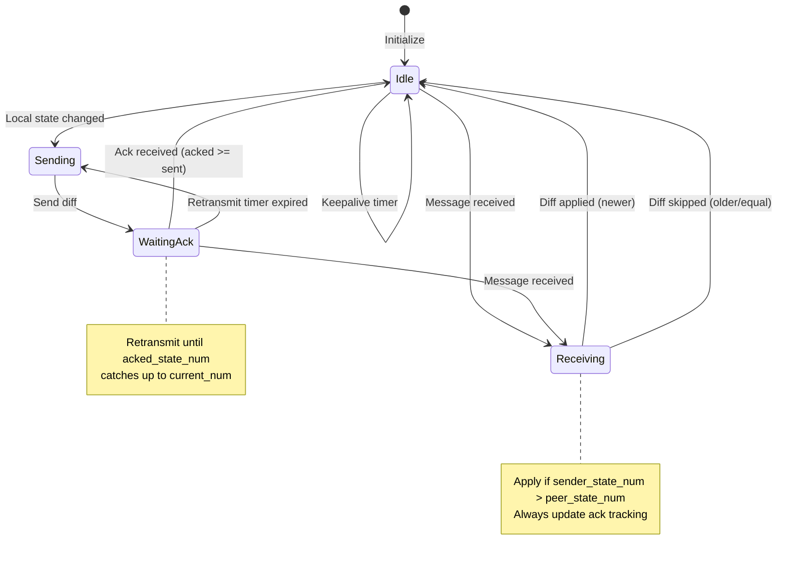
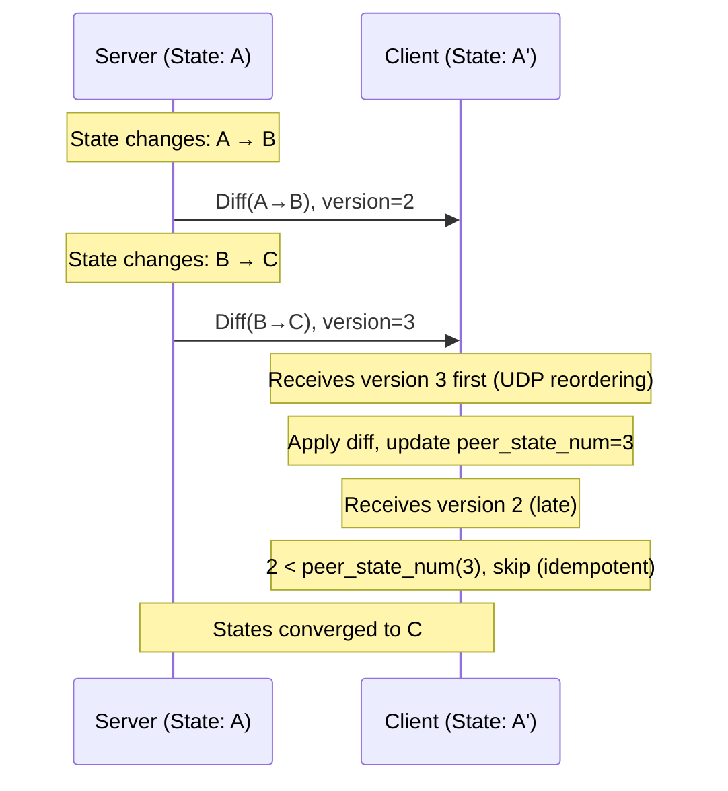

# NOMAD Sync Layer Specification

**Parent:** [0-PROTOCOL.md](0-PROTOCOL.md)

---

## Overview

The sync layer provides:
- State versioning with monotonic version numbers
- Idempotent diff generation and application
- Acknowledgment tracking
- Eventual consistency guarantees

The sync layer is **transport-agnostic** and can synchronize any state type that implements the required interface.

---

## Core Principle: Idempotent Diffs

> Applying the same diff twice has no additional effect.

This is the foundation of NOMAD's reliability over unreliable UDP:
- Duplicate packets are harmless
- Out-of-order packets are handled via version numbers
- No retransmission logic needed at transport layer

---

## State Type Interface

A valid NOMAD state type MUST implement:

```python
class SyncState(Protocol):
    """Interface for synchronizable state types."""

    # Unique identifier (e.g., "nomad.terminal.v1")
    STATE_TYPE_ID: str

    def diff(self, old_state: Self, new_state: Self) -> bytes:
        """Create diff from old_state to new_state.

        The diff MUST be idempotent: applying it multiple times
        produces the same result as applying it once.
        """
        ...

    def apply(self, state: Self, diff: bytes) -> Self:
        """Apply diff to state, producing new state.

        Must handle:
        - Valid diff from any previous state
        - Repeated application of same diff (idempotent)
        """
        ...

    def encode_diff(self, diff: bytes) -> bytes:
        """Serialize diff for transmission."""
        ...

    def decode_diff(self, data: bytes) -> bytes:
        """Deserialize diff from bytes."""
        ...
```

---

## Sync Message Format


| Field | Size | Description |
|-------|------|-------------|
| Sender State Num | 8 bytes | Version of sender's current state (LE64) |
| Acked State Num | 8 bytes | Highest version received from peer (LE64) |
| Base State Num | 8 bytes | Version this diff was computed from (LE64) |
| Diff Length | 4 bytes | Length of diff payload in bytes (LE32) |
| Diff Payload | variable | Application-specific diff encoding |

**Minimum size:** 28 bytes (header only, empty diff for ack-only)

### Base State Num Rationale

The `base_state_num` field serves two purposes:

1. **Debugging**: Helps trace which state transition a diff represents
2. **Future optimization**: Could enable diff chaining or conflict detection

**Current behavior**: Receivers ignore `base_state_num` and apply diffs based solely on `sender_state_num` comparison. The diff MUST be designed to converge regardless of the receiver's current state (idempotent).

> **Note**: Mosh's SSP uses only two version numbers. The third field adds 8 bytes overhead but improves debuggability. Implementations MAY validate that `base_state_num <= sender_state_num`.

---

## Sync State Tracking

Each endpoint maintains:

```python
class SyncTracker:
    # Local state
    current: State              # Current local state
    current_num: uint64         # Version of current state (monotonic)

    # Sent state tracking
    last_sent: State            # Last state we sent diff for
    last_sent_num: uint64       # Version of last sent state

    # Ack tracking
    last_acked: uint64          # Highest version acked by peer
    peer_state_num: uint64      # Highest version received from peer
```

---

## Synchronization Algorithm

### Sender Logic

Triggered on state change OR periodic timer:

```python
def send_sync():
    if current_num > last_sent_num or should_retransmit():
        diff = state_type.diff(last_sent, current)

        send(SyncMessage(
            sender_state_num = current_num,
            acked_state_num = peer_state_num,   # What we've received
            base_state_num = last_sent_num,
            diff = state_type.encode_diff(diff)
        ))

        last_sent = current.clone()
        last_sent_num = current_num
```

### Receiver Logic

On message receipt:

```python
def receive_sync(msg: SyncMessage):
    # Update ack tracking
    if msg.acked_state_num > last_acked:
        last_acked = msg.acked_state_num

    # Apply diff if newer (idempotent: safe if duplicate)
    if msg.sender_state_num > peer_state_num:
        diff = state_type.decode_diff(msg.diff)
        peer_state = state_type.apply(peer_state, diff)
        peer_state_num = msg.sender_state_num
```

---

## Convergence Guarantees

The sync algorithm guarantees **eventual consistency**:

1. **Idempotent diffs**: Applying same diff twice is safe
2. **Known base state**: Diffs computed from tracked state
3. **Monotonic versions**: Out-of-order handled via version comparison
4. **Best-effort delivery**: State converges when any message gets through

### Sync State Machine

Each endpoint maintains a sync state machine:



### Message Flow Example



---

## Retransmission Strategy

Since diffs are idempotent, retransmission is simple. Timing is controlled by the transport layer's adaptive RTO (see [2-TRANSPORT.md](2-TRANSPORT.md#retransmission)).

```python
def should_retransmit() -> bool:
    # Retransmit if peer hasn't acked our latest state
    if last_acked < current_num:
        # Use transport layer's adaptive timeout
        if time_since_last_send > transport.RTO:
            return True
    return False
```

The sync layer defers to the transport layer for:
- Adaptive timeout calculation (based on RTT)
- Exponential backoff on repeated retransmits
- Frame rate limiting

---

## Diff Payload Encoding

The diff payload format is **application-defined**. The sync layer treats it as opaque bytes.

### Recommendations

| Format | Pros | Cons |
|--------|------|------|
| Protocol Buffers | Cross-language, schema evolution | Adds dependency |
| MessagePack | Compact, schemaless | No schema validation |
| Custom binary | Maximum control | Document thoroughly |

### Compression

If compression is enabled (see [4-EXTENSIONS.md](4-EXTENSIONS.md)), it applies to the diff payload:

```
wire_payload = compress(diff_payload)  # if compression enabled
wire_payload = diff_payload            # otherwise
```

---

## Ack-Only Messages

When no state change occurred but acknowledgment is needed:

- Set `Diff Length = 0`
- Omit diff payload
- `Sender State Num` = current version (unchanged)
- `Acked State Num` = highest received version
- `Base State Num` = 0 (ignored when no diff)

Used for:
- Keepalive with ack
- Acknowledging received state without local changes

---

## State Skipping

A key property of NOMAD (inherited from Mosh) is **state skipping**: intermediate states may be lost if the network is slow.

### Trade-offs

| Scenario | Behavior | Impact |
|----------|----------|--------|
| Fast typing | Characters batched | Lower bandwidth, same end result |
| Large output | Intermediate screens skipped | Terminal catches up quickly |
| `cat bigfile.txt` | Most output lost | User sees final state only |

### Implications for Applications

- **Interactive use**: Excellent - feels responsive even on high-latency links
- **Scrollback**: Lost unless explicitly synchronized (see [4-EXTENSIONS.md](4-EXTENSIONS.md#scrollback))
- **Logging**: Applications needing full history should use TCP, not NOMAD

### Asymmetric Skip-ability

Different state types may have different requirements:

| Direction | State Type | Skip-able? | Rationale |
|-----------|------------|------------|-----------|
| Client→Server | Keystrokes | ❌ No | Every keystroke matters |
| Server→Client | Screen state | ✅ Yes | Only current state matters |

State types MUST document whether intermediate states can be safely skipped.

---

## Formal Verification

The sync layer has been formally verified using TLA+.

### TLA+ Specification

| Spec | Properties Verified |
|------|---------------------|
| `formal/tlaplus/SyncLayer.tla` | Eventual consistency, idempotent diffs, monotonic versions |

### Verified Properties

| Property | Type | Result | Description |
|----------|------|--------|-------------|
| MonotonicStateNums | Safety | ✅ Proven | State versions only increase |
| AckedNeverExceedsSent | Safety | ✅ Proven | Acks bounded by sent versions |
| PeerNeverAhead | Safety | ✅ Proven | Receiver can't be ahead of sender |
| ValidMessages | Safety | ✅ Proven | Messages have valid version numbers |
| EventualConsistency | Liveness | ✅ Proven | States converge when messages get through |

### Convergence Guarantee

The TLA+ model proves that under fair scheduling (eventual message delivery), the sync layer achieves eventual consistency:

```
EventualConsistency ==
    \A n \in 1..NumNodes :
        [](state_num[n] = state_num[n]) ~>
            (peer_state_num[Peer(n)] = state_num[n])
```

This formalizes the core promise: **if at least one message gets through, states converge**.

See `formal/README.md` for instructions on running the verification tools.

---

## Test Mapping

| Spec Section | Test File |
|--------------|-----------|
| Sync message format | `tests/unit/test_diff_encode.py` |
| Diff encoding | `tests/unit/test_diff_encode.py` |
| Diff decoding | `tests/unit/test_diff_decode.py` |
| Idempotent application | `tests/unit/test_diff_apply.py` |
| Basic sync flow | `tests/protocol/test_sync_flow.py` |
| Convergence | `tests/protocol/test_sync_convergence.py` |
| Edge cases | `tests/protocol/test_sync_edge_cases.py` |
| Property-based tests | `tests/protocol/test_sync_properties.py` |
