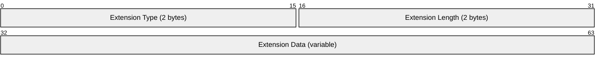
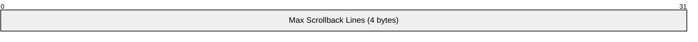
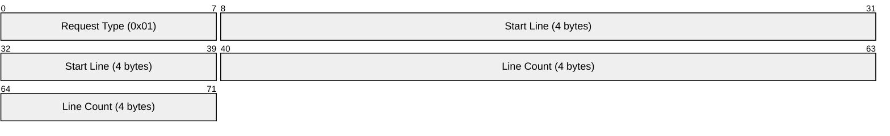
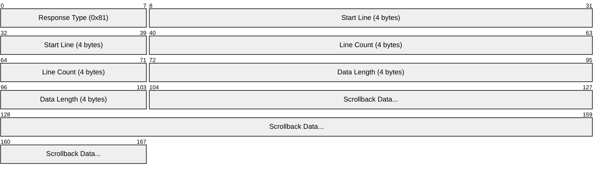

# NOMAD Extensions Specification

**Parent:** [0-PROTOCOL.md](0-PROTOCOL.md)

---

## Overview

NOMAD supports optional extensions negotiated during handshake. Extensions provide:
- Compression (zstd)
- Scrollback synchronization (terminal-specific)
- Client-side prediction (terminal-specific)
- Future extensibility

---

## Extension Negotiation

Extensions are negotiated during handshake:

1. Initiator includes desired extensions in HandshakeInit
2. Responder replies with supported subset in HandshakeResp
3. Only mutually supported extensions are active
4. Unknown extensions MUST be ignored (forward compatibility)

---

## Extension Format (TLV)



| Field | Size | Description |
|-------|------|-------------|
| Type | 2 bytes | Extension identifier (LE16) |
| Length | 2 bytes | Length of data in bytes (LE16) |
| Data | variable | Extension-specific data |

---

## Defined Extensions

| Type | Name | Description | Scope |
|------|------|-------------|-------|
| `0x0001` | Compression | Payload compression (zstd) | Core |
| `0x0002` | Scrollback | Scrollback buffer sync | Terminal |
| `0x0003` | Prediction | Client-side prediction | Terminal |
| `0x0004` | Multiplex | Multiple state streams | Future |
| `0x0005` | PostQuantum | Hybrid X25519+ML-KEM | Future |

---

## Extension 0x0001: Compression

Enables zstd compression of diff payloads.

### Negotiation Data


| Field | Value | Description |
|-------|-------|-------------|
| Level | 1-22 | zstd compression level (default: 3) |

### Behavior

When enabled:
- Diff payloads are compressed before encryption
- Prepend 1-byte flag: `0x01` = compressed, `0x00` = uncompressed
- Small payloads MAY skip compression if larger after

```python
def encode_payload(diff: bytes) -> bytes:
    if compression_enabled and len(diff) > MIN_COMPRESS_SIZE:
        compressed = zstd.compress(diff, level=compression_level)
        if len(compressed) < len(diff):
            return b'\x01' + compressed
    return b'\x00' + diff

def decode_payload(data: bytes) -> bytes:
    if data[0] == 0x01:
        return zstd.decompress(data[1:])
    return data[1:]
```

| Constant | Value | Description |
|----------|-------|-------------|
| `MIN_COMPRESS_SIZE` | 64 bytes | Minimum size to attempt compression |

---

## Extension 0x0002: Scrollback (Terminal-Specific)

Enables synchronization of terminal scrollback buffer.

> **Note:** This extension is only relevant for `nomad.terminal.v1` state type.

### Negotiation Data



| Field | Value | Description |
|-------|-------|-------------|
| Max Lines | LE32 | Maximum scrollback lines to sync (0 = unlimited) |

### Behavior

When enabled:
- Server includes scrollback diffs in state
- Client can request scrollback range
- Scrollback is append-only (simplifies sync)

### Scrollback Request Message

Client → Server (in sync message payload):



### Scrollback Response

Server → Client (in diff payload):



---

## Extension 0x0003: Prediction (Terminal-Specific)

Enables client-side prediction for reduced perceived latency.

> **Note:** This extension is only relevant for `nomad.terminal.v1` state type.

### Negotiation Data


| Bit | Name | Description |
|-----|------|-------------|
| 0 | LOCAL_ECHO | Enable local keystroke echo |
| 1 | CURSOR_PREDICT | Predict cursor movement |
| 2 | SCROLL_PREDICT | Predict scroll on newline |
| 3-7 | Reserved | Must be 0 |

### Behavior

When enabled:
- Client predicts effect of keystrokes locally
- Server state is authoritative
- Client corrects prediction when server state arrives
- Mismatch triggers visual correction (subtle flash)

### Prediction Algorithm

```python
class Predictor:
    pending_input: List[bytes]      # Input sent, not yet confirmed
    predicted_state: TerminalState  # Local prediction

    def on_input(self, key: bytes):
        # Send to server
        send_to_server(key)
        pending_input.append(key)

        # Predict locally
        if is_printable(key):
            predicted_state.insert_char(key)
        elif key == BACKSPACE:
            predicted_state.delete_char()
        # ... etc

    def on_server_state(self, state: TerminalState):
        # Server state is authoritative
        confirmed_state = state

        # Check if prediction was correct
        if predicted_state != confirmed_state:
            # Visual correction (subtle)
            show_correction_indicator()

        # Clear confirmed input from pending
        pending_input = pending_input[confirmed_count:]

        # Reapply remaining pending input
        predicted_state = confirmed_state.clone()
        for key in pending_input:
            apply_prediction(key)
```

### Prediction Safety

Prediction is disabled for:
- Password prompts (detected via terminal mode changes)
- Non-printable input sequences
- When server indicates prediction unsafe

---

## Extension 0x0004: Multiplex (Future)

> **Status:** Reserved for future use

Would enable multiple state streams in one session.

---

## Extension 0x0005: PostQuantum (Future)

> **Status:** Reserved for future use

Would enable hybrid X25519+ML-KEM key exchange for post-quantum security.

---

## Extension Versioning

Extensions use their own versioning:
- Extension type ID includes implicit version
- Breaking changes = new extension type
- Backward-compatible additions = same type, new fields ignored by old implementations

---

## Test Mapping

| Spec Section | Test File | Scope |
|--------------|-----------|-------|
| Extension negotiation | `tests/protocol/test_extension_negotiation.py` | Core |
| Compression | `tests/protocol/test_compression.py` | Core |
| Scrollback | `tests/terminal/test_scrollback.py` | Terminal |
| Prediction | `tests/terminal/test_prediction.py` | Terminal |

---

## Implementation Notes

### Compression Library Choice

| Language | Recommended Library |
|----------|---------------------|
| Rust | `zstd` crate |
| Go | `github.com/klauspost/compress/zstd` |
| Python | `zstandard` |
| TypeScript | `@aspect/zstd` |

### Prediction Latency Targets

| Metric | Target | Description |
|--------|--------|-------------|
| Local echo | < 10ms | User sees keystroke immediately |
| Correction | < 100ms | Mismatch corrected within RTT |
| Flash duration | 50ms | Visual correction indicator |
