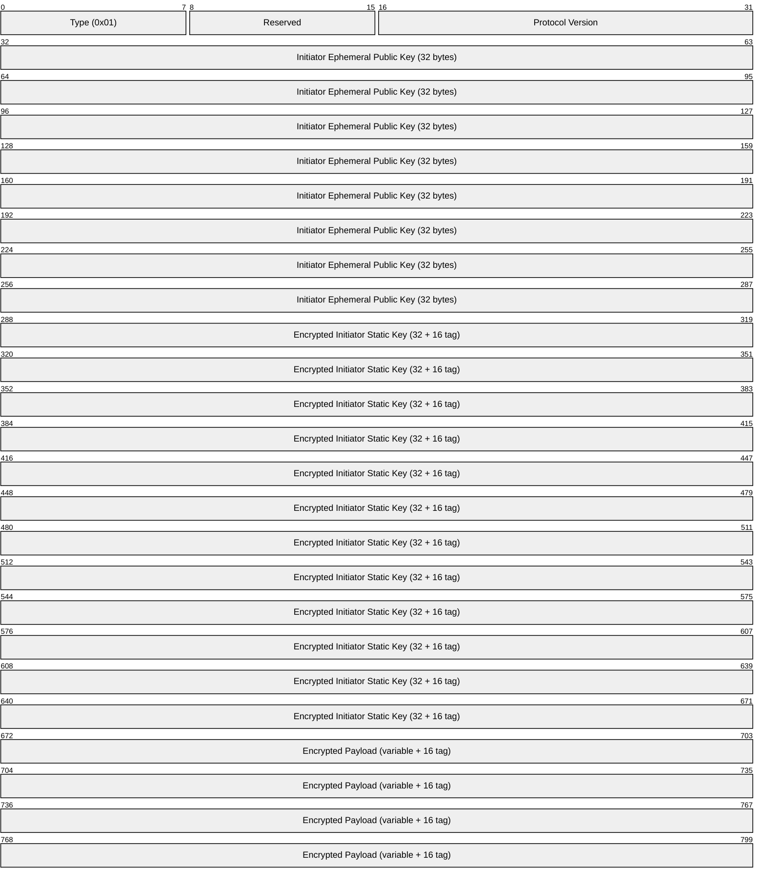
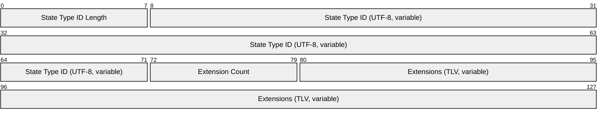
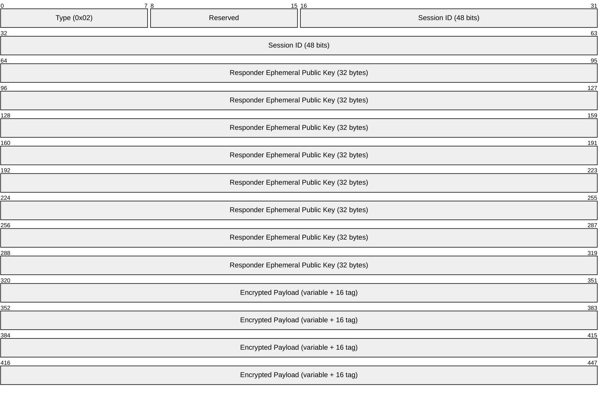
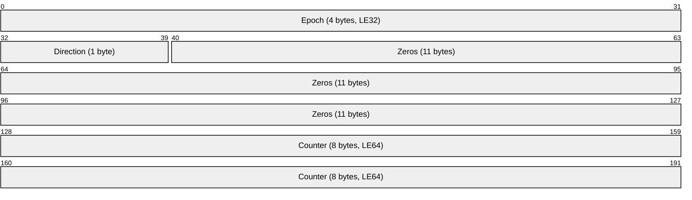
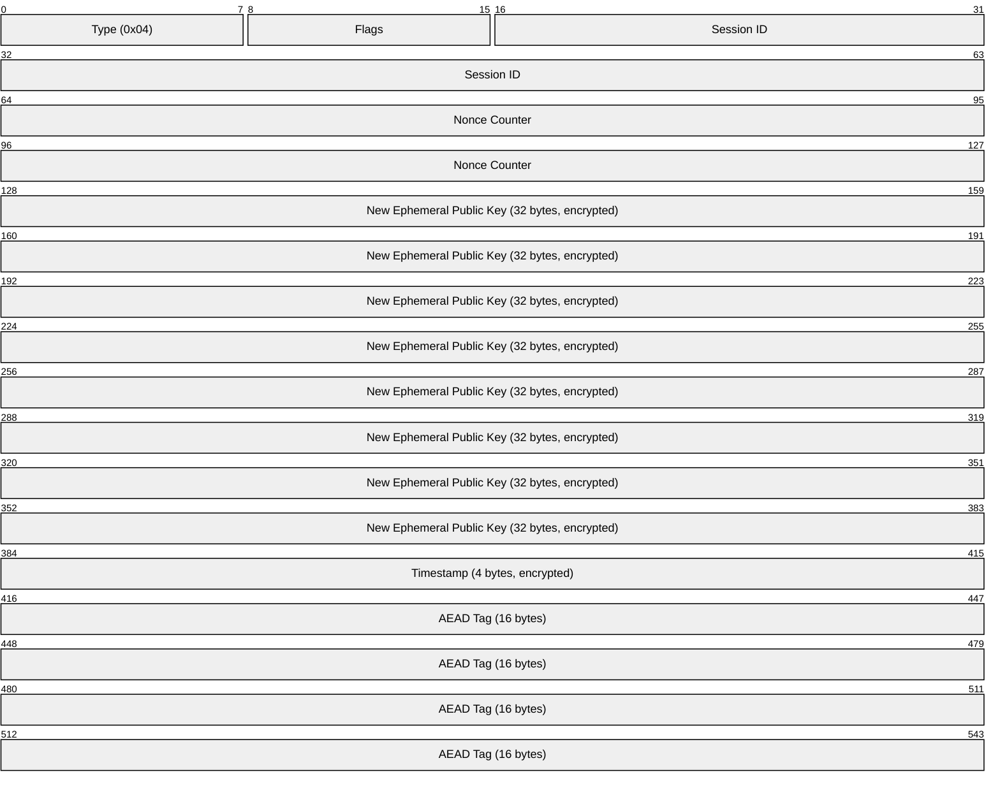
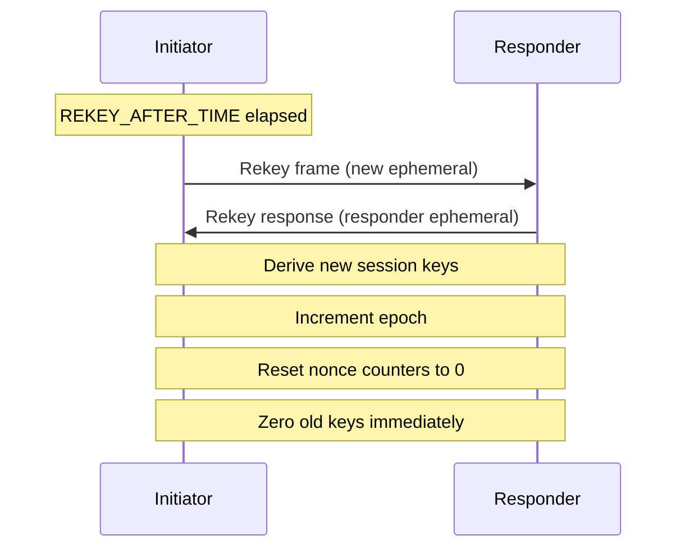

# NOMAD Security Layer Specification

**Parent:** [PROTOCOL.md](PROTOCOL.md)

---

## Overview

The security layer provides:
- Mutual authentication via Noise_IK handshake
- Authenticated encryption via XChaCha20-Poly1305
- Forward secrecy via periodic rekeying
- Identity hiding for initiator

---

## Handshake Protocol

NOMAD uses the **Noise_IK** pattern for 1-RTT mutual authentication.

### Prerequisites

- Initiator MUST know Responder's static public key beforehand (via SSH, QR code, etc.)
- Both parties MUST have static X25519 keypairs

### Noise_IK Pattern

```
Noise_IK(s, rs):
  <- s                    # Responder's static key known to Initiator
  ...
  -> e, es, s, ss         # Initiator sends ephemeral + encrypted static
  <- e, ee, se            # Responder sends ephemeral, completes DH
```

Where:
- `e` = ephemeral public key (32 bytes)
- `s` = static public key (encrypted after first DH)
- `es`, `ss`, `ee`, `se` = Diffie-Hellman operations mixed into symmetric state

---

## Handshake Initiation (Type 0x01)

Initiator → Responder



| Field | Size | Description |
|-------|------|-------------|
| Type | 1 byte | `0x01` (HandshakeInit) |
| Reserved | 1 byte | `0x00` |
| Protocol Version | 2 bytes | `0x0001` for v1.0 (LE16) |
| Initiator Ephemeral | 32 bytes | Unencrypted X25519 public key |
| Encrypted Static | 48 bytes | Initiator's static key + AEAD tag |
| Encrypted Payload | variable | State type ID + extensions + AEAD tag |

**Minimum size:** 100 bytes (4 + 32 + 48 + 16)

### Encrypted Payload Contents



---

## Handshake Response (Type 0x02)

Responder → Initiator



| Field | Size | Description |
|-------|------|-------------|
| Type | 1 byte | `0x02` (HandshakeResp) |
| Reserved | 1 byte | `0x00` |
| Session ID | 6 bytes | Random identifier for this session |
| Responder Ephemeral | 32 bytes | Unencrypted X25519 public key |
| Encrypted Payload | variable | Ack + negotiated extensions + AEAD tag |

**Minimum size:** 56 bytes (2 + 6 + 32 + 16)

---

## Session Key Derivation

After successful handshake, both parties derive session keys:

```
(initiator_key, responder_key) = HKDF-Expand(
    handshake_hash,
    "nomad v1 session keys",
    64
)
```

| Party | Send Key | Receive Key |
|-------|----------|-------------|
| Initiator | `initiator_key` | `responder_key` |
| Responder | `responder_key` | `initiator_key` |

---

## AEAD Encryption

All post-handshake frames use XChaCha20-Poly1305 AEAD.

### Nonce Construction (24 bytes)



| Field | Value |
|-------|-------|
| Epoch | Current epoch number, starts at 0 |
| Direction | `0x00` = Initiator→Responder, `0x01` = Responder→Initiator |
| Zeros | Padding |
| Counter | Per-direction frame counter, starts at 0 |

### Additional Authenticated Data (AAD)

The frame header (type, flags, session ID, nonce counter) is used as AAD:

```
AAD = frame_header[0..16]
```

---

## Rekeying (Type 0x04)

Sessions MUST rekey periodically for forward secrecy.

### Timing Constants

| Constant | Value | Description |
|----------|-------|-------------|
| `REKEY_AFTER_TIME` | 120 seconds | Initiate rekey after this time |
| `REKEY_AFTER_MESSAGES` | 2^60 | Initiate rekey after this many frames |
| `REJECT_AFTER_TIME` | 180 seconds | Hard limit, reject old keys |

### Rekey Frame Format

Encrypted with current session keys:



### Rekey Procedure



### Post-Rekey Keys

```
(new_initiator_key, new_responder_key) = HKDF-Expand(
    new_handshake_hash,
    "nomad v1 rekey" || LE32(epoch),
    64
)
```

---

## Anti-Replay Protection

Implementations MUST maintain a sliding window of received nonces.

| Parameter | Value |
|-----------|-------|
| Window size | 2048 bits minimum |
| Below window | MUST reject |
| Seen nonce | MUST reject |
| Above highest | Update window |

---

## Security Properties

| Property | Provided | Mechanism |
|----------|----------|-----------|
| Confidentiality | ✅ | XChaCha20-Poly1305 AEAD |
| Integrity | ✅ | Poly1305 authentication tag |
| Authenticity | ✅ | Noise_IK mutual authentication |
| Forward secrecy | ✅ | Ephemeral keys + 2-minute rekeying |
| Replay protection | ✅ | Nonce counter + sliding window |
| Identity hiding (initiator) | ✅ | Static key encrypted under responder's key |
| Identity hiding (responder) | ❌ | Responder's public key must be known |

---

## Implementation Requirements

Implementations MUST:

1. Use constant-time comparison for all secret-dependent operations
2. Zero memory containing keys when no longer needed
3. Use cryptographically secure RNG for all random values
4. Validate all input lengths before processing
5. Reject frames with invalid AEAD tags without timing differences

Implementations SHOULD:

1. Add random delays (0-50ms) to keystroke-like input to resist timing analysis
2. Pad frames to fixed sizes when traffic analysis is a concern
3. Implement rate limiting on handshake attempts
4. Log security-relevant events

---

## Test Vectors

See `tests/vectors/handshake_vectors.json5` for:
- Valid handshake initiation messages
- Valid handshake response messages
- Session key derivation test cases
- AEAD encryption test cases
- Rekey test cases

---

## Test Mapping

| Spec Section | Test File |
|--------------|-----------|
| Handshake | `tests/protocol/test_handshake.py` |
| AEAD | `tests/unit/test_crypto.py` |
| Nonce construction | `tests/unit/test_nonce.py` |
| Rekeying | `tests/protocol/test_rekeying.py` |
| Anti-replay | `tests/protocol/test_replay_rejection.py` |
| Invalid auth | `tests/adversarial/test_invalid_auth.py` |
