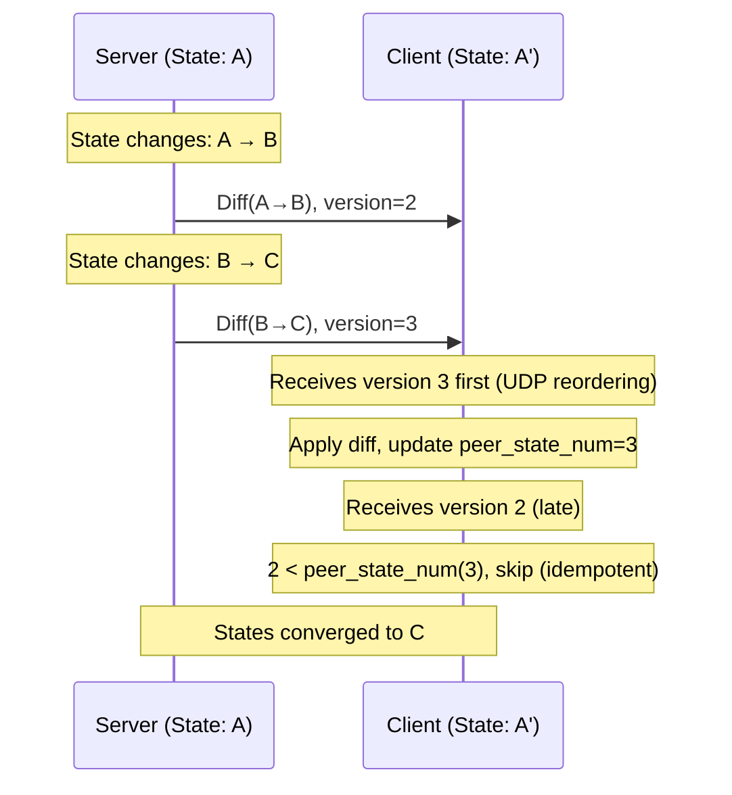

# NOMAD Sync Layer Specification

**Parent:** [PROTOCOL.md](PROTOCOL.md)

---

## Overview

The sync layer provides:
- State versioning with monotonic version numbers
- Idempotent diff generation and application
- Acknowledgment tracking
- Eventual consistency guarantees

The sync layer is **transport-agnostic** and can synchronize any state type that implements the required interface.

---

## Core Principle: Idempotent Diffs

> Applying the same diff twice has no additional effect.

This is the foundation of NOMAD's reliability over unreliable UDP:
- Duplicate packets are harmless
- Out-of-order packets are handled via version numbers
- No retransmission logic needed at transport layer

---

## State Type Interface

A valid NOMAD state type MUST implement:

```python
class SyncState(Protocol):
    """Interface for synchronizable state types."""

    # Unique identifier (e.g., "nomad.terminal.v1")
    STATE_TYPE_ID: str

    def diff(self, old_state: Self, new_state: Self) -> bytes:
        """Create diff from old_state to new_state.

        The diff MUST be idempotent: applying it multiple times
        produces the same result as applying it once.
        """
        ...

    def apply(self, state: Self, diff: bytes) -> Self:
        """Apply diff to state, producing new state.

        Must handle:
        - Valid diff from any previous state
        - Repeated application of same diff (idempotent)
        """
        ...

    def encode_diff(self, diff: bytes) -> bytes:
        """Serialize diff for transmission."""
        ...

    def decode_diff(self, data: bytes) -> bytes:
        """Deserialize diff from bytes."""
        ...
```

---

## Sync Message Format


| Field | Size | Description |
|-------|------|-------------|
| Sender State Num | 8 bytes | Version of sender's current state (LE64) |
| Acked State Num | 8 bytes | Highest version received from peer (LE64) |
| Base State Num | 8 bytes | Version this diff applies to (LE64) |
| Diff Length | 4 bytes | Length of diff payload in bytes (LE32) |
| Diff Payload | variable | Application-specific diff encoding |

**Minimum size:** 28 bytes (header only, empty diff for ack-only)

---

## Sync State Tracking

Each endpoint maintains:

```python
class SyncTracker:
    # Local state
    current: State              # Current local state
    current_num: uint64         # Version of current state (monotonic)

    # Sent state tracking
    last_sent: State            # Last state we sent diff for
    last_sent_num: uint64       # Version of last sent state

    # Ack tracking
    last_acked: uint64          # Highest version acked by peer
    peer_state_num: uint64      # Highest version received from peer
```

---

## Synchronization Algorithm

### Sender Logic

Triggered on state change OR periodic timer:

```python
def send_sync():
    if current_num > last_sent_num or should_retransmit():
        diff = state_type.diff(last_sent, current)

        send(SyncMessage(
            sender_state_num = current_num,
            acked_state_num = peer_state_num,   # What we've received
            base_state_num = last_sent_num,
            diff = state_type.encode_diff(diff)
        ))

        last_sent = current.clone()
        last_sent_num = current_num
```

### Receiver Logic

On message receipt:

```python
def receive_sync(msg: SyncMessage):
    # Update ack tracking
    if msg.acked_state_num > last_acked:
        last_acked = msg.acked_state_num

    # Apply diff if newer (idempotent: safe if duplicate)
    if msg.sender_state_num > peer_state_num:
        diff = state_type.decode_diff(msg.diff)
        peer_state = state_type.apply(peer_state, diff)
        peer_state_num = msg.sender_state_num
```

---

## Convergence Guarantees

The sync algorithm guarantees **eventual consistency**:

1. **Idempotent diffs**: Applying same diff twice is safe
2. **Known base state**: Diffs computed from tracked state
3. **Monotonic versions**: Out-of-order handled via version comparison
4. **Best-effort delivery**: State converges when any message gets through



---

## Retransmission Strategy

Since diffs are idempotent, retransmission is simple:

```python
def should_retransmit() -> bool:
    # Retransmit if peer hasn't acked our latest state
    if last_acked < current_num:
        # And sufficient time has passed
        if time_since_last_send > RETRANSMIT_INTERVAL:
            return True
    return False
```

| Constant | Value | Description |
|----------|-------|-------------|
| `RETRANSMIT_INTERVAL` | 250ms | Minimum time between retransmits |
| `MAX_RETRANSMIT_INTERVAL` | 5s | Maximum backoff |

---

## Diff Payload Encoding

The diff payload format is **application-defined**. The sync layer treats it as opaque bytes.

### Recommendations

| Format | Pros | Cons |
|--------|------|------|
| Protocol Buffers | Cross-language, schema evolution | Adds dependency |
| MessagePack | Compact, schemaless | No schema validation |
| Custom binary | Maximum control | Document thoroughly |

### Compression

If compression is enabled (see [EXTENSIONS.md](EXTENSIONS.md)), it applies to the diff payload:

```
wire_payload = compress(diff_payload)  # if compression enabled
wire_payload = diff_payload            # otherwise
```

---

## Ack-Only Messages

When no state change occurred but acknowledgment is needed:

- Set `Diff Length = 0`
- Omit diff payload
- `Sender State Num` = current version (unchanged)
- `Acked State Num` = highest received version
- `Base State Num` = 0 (ignored when no diff)

Used for:
- Keepalive with ack
- Acknowledging received state without local changes

---

## State Version Overflow

State numbers are 64-bit unsigned integers. At 1000 updates/second:
- Time to overflow: ~584 million years

No overflow handling required. Sessions will rekey and terminate long before overflow.

---

## Test Mapping

| Spec Section | Test File |
|--------------|-----------|
| Sync message format | `tests/unit/test_diff_encoding.py` |
| Convergence | `tests/protocol/test_sync_convergence.py` |
| Idempotent diffs | `tests/protocol/test_sync_convergence.py` |
| Ack tracking | `tests/protocol/test_sync_convergence.py` |
| Retransmission | `tests/protocol/test_sync_convergence.py` |
