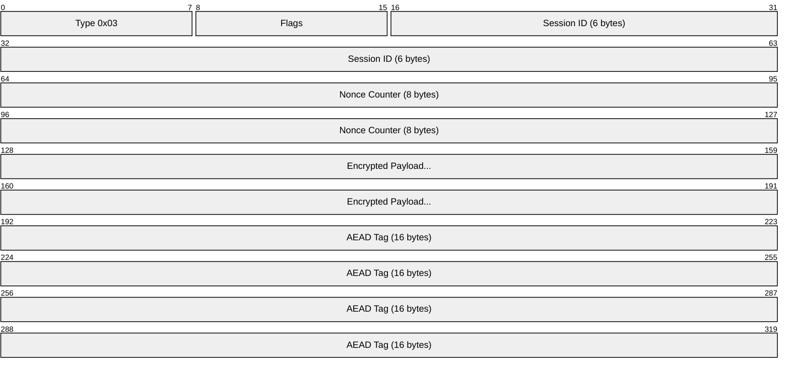
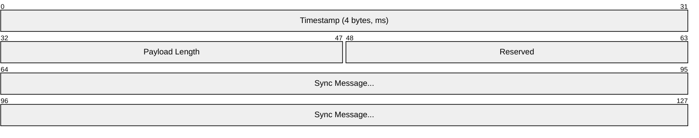
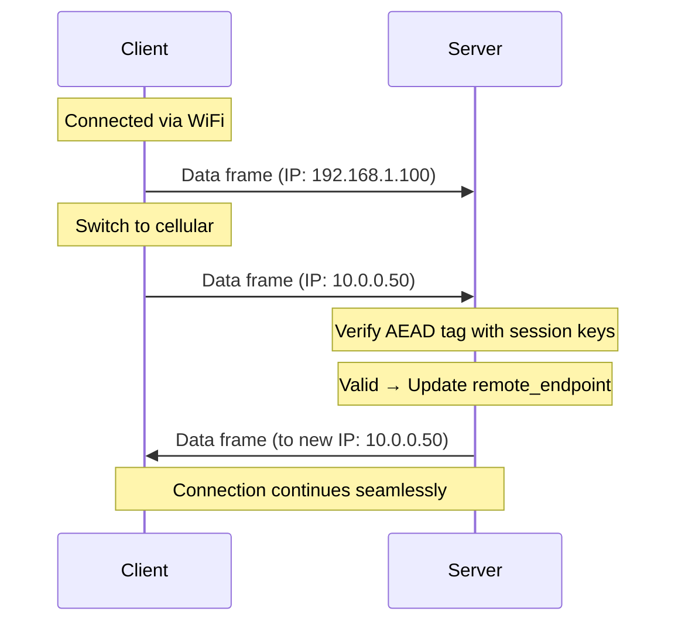

# NOMAD Transport Layer Specification

**Parent:** [PROTOCOL.md](PROTOCOL.md)

---

## Overview

The transport layer provides:
- Frame construction and parsing
- Session identification
- Connection migration (roaming)
- Keepalive and timeout management
- Graceful termination

---

## Connection State

Each endpoint maintains:

```python
class ConnectionState:
    session_id: bytes[6]         # From handshake
    send_key: bytes[32]          # Current sending key
    recv_key: bytes[32]          # Current receiving key
    send_nonce: uint64           # Monotonically increasing
    recv_nonce_window: BitField  # Anti-replay window (2048+ bits)
    remote_endpoint: SocketAddr  # Last known peer address
    last_received: Timestamp     # For timeout detection
    epoch: uint32                # Increments on rekey
```

---

## Data Frame Format (Type 0x03)



| Field | Size | Description |
|-------|------|-------------|
| Type | 1 byte | `0x03` (Data) |
| Flags | 1 byte | See flags table below |
| Session ID | 6 bytes | Session identifier from handshake |
| Nonce Counter | 8 bytes | LE64, per-direction counter |
| Encrypted Payload | variable | Payload header + sync message |
| AEAD Tag | 16 bytes | Poly1305 authentication tag |

**Header size:** 16 bytes (unencrypted, used as AAD)
**Minimum frame size:** 32 bytes (header + empty payload + tag)

### Flags Byte

| Bit | Name | Description |
|-----|------|-------------|
| 0 | ACK_ONLY | Frame contains only acknowledgment, no state diff |
| 1 | HAS_EXTENSION | Extension data follows payload |
| 2-7 | Reserved | Must be 0 |

---

## Encrypted Payload Structure

After decryption:



| Field | Size | Description |
|-------|------|-------------|
| Timestamp | 4 bytes | Milliseconds since epoch start (for RTT) |
| Payload Length | 2 bytes | Length of sync message (LE16) |
| Reserved | 2 bytes | Must be 0 |
| Sync Message | variable | See [SYNC.md](SYNC.md) |

---

## Close Frame Format (Type 0x05)

For graceful termination:


| Field | Size | Description |
|-------|------|-------------|
| Type | 1 byte | `0x05` (Close) |
| Flags | 1 byte | `0x00` |
| Session ID | 6 bytes | Session identifier |
| Nonce Counter | 8 bytes | LE64 |
| Final Ack | 8 bytes | Highest state version acked (encrypted) |
| AEAD Tag | 16 bytes | Authentication tag |

---

## Connection Migration (Roaming)

NOMAD supports seamless IP address changes (WiFi ↔ cellular).

### Migration Procedure



### Migration Rules

1. When authenticated frame arrives from different source address:
   - Verify AEAD tag with current session keys
   - If valid: update `remote_endpoint` to new address
   - If invalid: silently drop (prevents spoofing)
2. Immediately send subsequent frames to new address
3. No handshake required
4. Works for both initiator and responder

---

## Keepalive

### Timing Constants

| Constant | Value | Description |
|----------|-------|-------------|
| `KEEPALIVE_INTERVAL` | 25 seconds | Send keepalive if no data sent |
| `DEAD_INTERVAL` | 60 seconds | Consider connection dead if no frames received |

### Keepalive Frame

A keepalive is a Data frame (0x03) with:
- Flags: `ACK_ONLY` (0x01)
- Payload: Zero-length sync message (just the ack)

---

## Timeout and Termination

### Graceful Close

1. Send Close frame with final ack
2. Zero all key material
3. Close socket
4. No response expected (best-effort)

### Timeout

1. If no authenticated frame received for `DEAD_INTERVAL`:
   - Consider session dead
   - Zero all key material
2. May attempt reconnection with new handshake

---

## Error Handling

| Error | Response | Rationale |
|-------|----------|-----------|
| Invalid AEAD tag | Silently drop | Prevent oracle attacks |
| Unknown session ID | Silently drop | Prevent session enumeration |
| Nonce replay | Silently drop | Prevent replay attacks |
| Frame too small | Silently drop | Prevent parsing exploits |
| Nonce below window | Silently drop | Old/replayed frame |

**Silent drops** prevent confirmation of session existence to attackers.

---

## MTU Considerations

| Network | Typical MTU | Recommended Max Payload |
|---------|-------------|-------------------------|
| Ethernet | 1500 bytes | 1400 bytes |
| IPv6 minimum | 1280 bytes | 1200 bytes |
| Mobile | varies | 1200 bytes (conservative) |

Implementations SHOULD:
- Default to 1200-byte max payload
- Allow configuration for specific networks
- Fragment at application layer if needed (not transport)

---

## Test Mapping

| Spec Section | Test File |
|--------------|-----------|
| Data frame format | `tests/wire/test_wire_format.py` |
| Frame parsing | `tests/unit/test_frame_encoding.py` |
| Connection migration | `tests/protocol/test_roaming.py` |
| Timeout handling | `tests/protocol/test_timeout_handling.py` |
| MTU compliance | `tests/wire/test_packet_sizes.py` |
| Error handling | `tests/adversarial/test_malformed_packets.py` |
